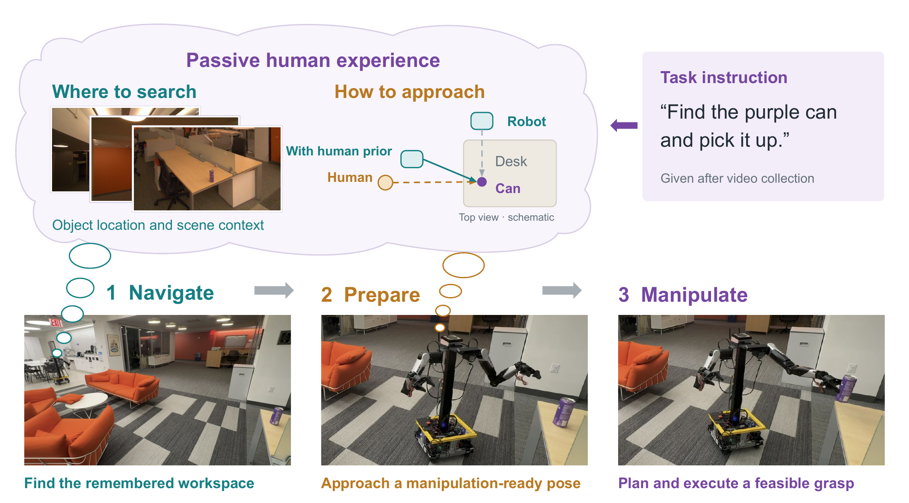

# MoCAP

This repository contains the MoCAP code for double-blind review.



## Repository structure

```text
yor_agent/                  Code-as-policy agent, robot primitives, and services
nav_planner/                Passive-video spatial memory and interaction events
baselines/mobilemanip/capx/ CaP-X mobile manipulation baseline
baselines/nav/cow/          CoW object navigation baseline
baselines/nav/apexnav/      ApexNav object navigation baseline
```

## Usage

Install the Python packages:

```bash
pip install -e ./nav_planner -e './yor_agent[manipulation]'
```

With API credentials configured, extract memory and interaction events from a video:

```bash
nav-planner /path/to/video.mp4 --model gpt-5.6-sol
nav-planner-readiness /path/to/video.mp4 --model gpt-5.6-sol
```

With the robot services running and hardware settings configured, run a task:

```bash
yor-agent --config yor_agent/configs/nav_comparison.yaml \
  --task-id grasp_can \
  --navigation-memory /path/to/memory.json \
  --readiness-events /path/to/manipulation_events.json
```

Agent settings are in `yor_agent/configs/`; baseline entry points and configurations are in their respective directories.
